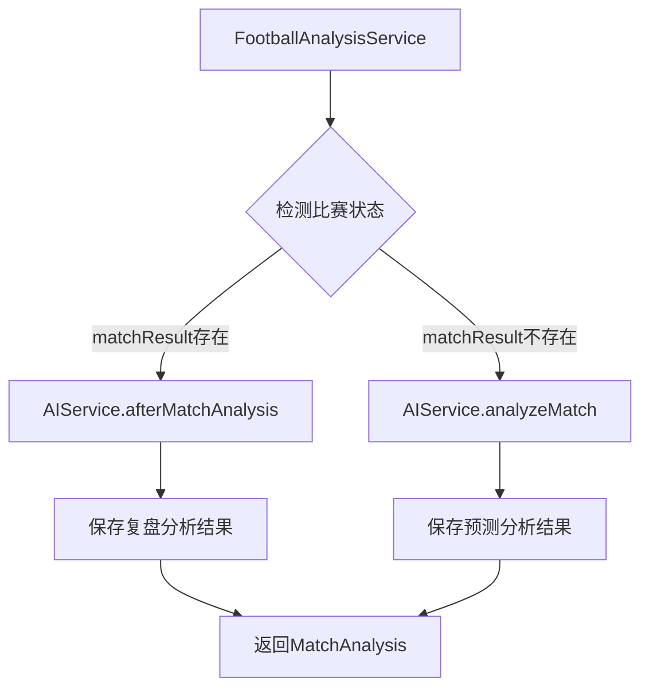

# Design Document: Match Result Analysis Switch

## Overview

本设计文档描述了如何在足球分析系统中实现基于比赛状态的智能分析路由功能。当系统检测到比赛已有结果时，将自动切换到赛后复盘分析模式，而非执行赛前预测分析。这样可以提供更有价值的分析内容，并帮助改进预测模型。

核心设计思路：
- 在 `FootballAnalysisService.analyzeSingleMatch()` 方法中添加比赛状态检测逻辑
- 根据 `matchResult` 字段判断比赛是否已完赛
- 已完赛比赛调用 `AIService.afterMatchAnalysis()` 进行复盘
- 未完赛比赛继续使用 `AIService.analyzeMatch()` 进行预测

## Architecture

### 系统架构



### 调用流程

1. **比赛分析入口**: `FootballAnalysisService.analyzeSingleMatch(SubMatchInfo match)`
2. **状态检测**: 查询 `AiAnalysisResult` 表，检查 `matchResult` 字段
3. **路由决策**: 
   - 如果 `matchResult` 存在且非空 → 调用赛后复盘
   - 如果 `matchResult` 不存在或为空 → 调用赛前预测
4. **执行分析**: 调用对应的AI分析方法
5. **结果保存**: 更新或插入 `AiAnalysisResult` 记录

## Components and Interfaces

### 1. FootballAnalysisService 修改

**修改方法**: `analyzeSingleMatch(SubMatchInfo match)`

**新增逻辑**:
```java
// 伪代码
private MatchAnalysis analyzeSingleMatch(SubMatchInfo match) {
    String matchId = String.valueOf(match.getMatchId());
    
    // 查询是否已有分析结果
    AiAnalysisResultVo existingResult = aiAnalysisResultService.findByMatchId(matchId);
    
    // 检查比赛是否已完赛
    boolean isMatchFinished = existingResult != null 
        && existingResult.getMatchResult() != null 
        && !existingResult.getMatchResult().isEmpty();
    
    if (isMatchFinished) {
        // 比赛已完赛，执行赛后复盘
        return performAfterMatchAnalysis(match, existingResult);
    } else {
        // 比赛未完赛，执行赛前预测
        return performPreMatchAnalysis(match, existingResult);
    }
}
```

**新增方法**: `performAfterMatchAnalysis(SubMatchInfo match, AiAnalysisResultVo existingResult)`

职责：
- 构建 `MatchAnalysis` 对象
- 调用 `AIService.afterMatchAnalysis()` 进行单场复盘
- 设置分析结果和时间戳
- 返回 `MatchAnalysis` 对象

**重构方法**: `performPreMatchAnalysis(SubMatchInfo match, AiAnalysisResultVo existingResult)`

职责：
- 将现有的赛前分析逻辑提取到此方法
- 保持原有功能不变

### 2. AIService 修改

**修改方法**: `afterMatchAnalysis()`

当前实现：批量处理所有已完赛但未复盘的比赛

**新增方法**: `afterMatchAnalysis(String matchId, String matchResult)`

职责：
- 接收单个比赛ID和比赛结果
- 查询该比赛的赛前分析内容
- 构建复盘分析提示词
- 调用AI进行复盘分析
- 返回复盘分析文本（不保存到数据库）

**方法签名**:
```java
public String afterMatchAnalysis(String matchId, String matchResult)
```

**实现逻辑**:
```java
// 伪代码
public String afterMatchAnalysis(String matchId, String matchResult) {
    // 查询赛前分析结果
    AiAnalysisResult result = aiAnalysisResultMapper.selectById(matchId);
    
    if (result == null) {
        throw new IllegalArgumentException("未找到比赛分析记录: " + matchId);
    }
    
    // 设置比赛结果
    result.setMatchResult(matchResult);
    
    // 构建复盘提示词
    String prompt = buildAfterAnalysisPrompt(result);
    
    // 调用AI进行复盘
    String analysis = assistant.chatV2(prompt);
    
    log.info("单场赛后复盘完成: matchId={}, analysis={}", matchId, analysis);
    
    return analysis;
}
```

### 3. MatchAnalysis DTO

**新增字段**:
- `isMatchFinished`: boolean - 标识比赛是否已完赛
- `matchResult`: String - 比赛结果
- `analysisType`: String - 分析类型（"PRE_MATCH" 或 "AFTER_MATCH"）

## Data Models

### AiAnalysisResult 实体

现有字段（无需修改）：
```java
private String id;
private String matchId;
private String homeTeam;
private String awayTeam;
private LocalDateTime matchTime;
private String homeWin;
private String draw;
private String awayWin;
private String aiAnalysis;          // 赛前分析
private String aiScore;
private String aiResult;
private String matchResult;         // 比赛结果（用于判断是否已完赛）
private String afterMatchAnalysis;  // 赛后复盘分析
private LocalDateTime createTime;
```

### MatchAnalysis DTO

新增字段：
```java
private boolean isMatchFinished;    // 比赛是否已完赛
private String matchResult;         // 比赛结果
private String analysisType;        // 分析类型
```

## Correctness Properties

*属性是一个特征或行为，应该在系统的所有有效执行中保持为真——本质上是关于系统应该做什么的正式声明。属性作为人类可读规范和机器可验证正确性保证之间的桥梁。*

### Property 1: Match Result Detection

*For any* 比赛ID，当系统查询比赛信息时，系统应该正确检查matchResult字段是否存在且非空，并据此判断比赛状态。

**Validates: Requirements 1.1, 1.2, 1.3**

### Property 2: Analysis Method Routing

*For any* 比赛数据，当比赛标记为已完赛状态时，系统应该调用afterMatchAnalysis方法；当比赛标记为未完赛状态时，系统应该调用analyzeMatch方法。

**Validates: Requirements 2.1, 2.2**

### Property 3: After Match Analysis Parameters

*For any* 已完赛比赛，当调用afterMatchAnalysis方法时，系统应该传递正确的比赛ID和比赛结果数据作为参数。

**Validates: Requirements 2.3**

### Property 4: Analysis Result Return

*For any* 分析方法调用，无论是赛前分析还是赛后复盘，系统都应该返回非空的分析结果文本。

**Validates: Requirements 2.4**

### Property 5: After Match Analysis Data Retrieval

*For any* 赛后复盘分析，系统应该正确查询该比赛的赛前分析内容和最终比赛结果。

**Validates: Requirements 3.1, 3.2**

### Property 6: Analysis Result Persistence

*For any* 完成的赛后复盘分析，系统应该将分析结果保存到对应matchId的AiAnalysisResult记录的afterMatchAnalysis字段中。

**Validates: Requirements 4.1, 4.2**

### Property 7: Database Error Handling

*For any* 数据库操作失败的情况，系统应该记录错误日志并返回包含错误信息的响应。

**Validates: Requirements 4.3**

### Property 8: Backward Compatibility

*For any* 未完赛比赛，系统应该使用原有的analyzeMatch流程，保持与现有功能的一致性。

**Validates: Requirements 5.1**

### Property 9: Default Behavior

*For any* 无法判断比赛状态的情况，系统应该默认使用analyzeMatch方法进行分析。

**Validates: Requirements 5.2**

### Property 10: Graceful Degradation

*For any* 新功能执行过程中出现的异常，系统应该降级到原有分析流程并记录警告日志。

**Validates: Requirements 5.3**

## Error Handling

### 异常场景处理

1. **比赛数据不存在**
   - 场景：查询不到指定matchId的比赛数据
   - 处理：记录警告日志，返回null或抛出IllegalArgumentException
   - 日志级别：WARN

2. **AI服务调用失败**
   - 场景：调用assistant.chatV2()时发生异常
   - 处理：捕获异常，记录错误日志，降级到返回默认分析文本
   - 日志级别：ERROR

3. **数据库操作失败**
   - 场景：保存或更新AiAnalysisResult记录失败
   - 处理：捕获异常，记录错误日志，返回错误信息给调用方
   - 日志级别：ERROR

4. **状态判断异常**
   - 场景：matchResult字段格式异常或无法解析
   - 处理：默认视为未完赛，使用赛前分析流程
   - 日志级别：WARN

### 降级策略

当新功能出现任何异常时，系统应该：
1. 记录详细的异常信息和堆栈跟踪
2. 降级到原有的analyzeMatch流程
3. 确保用户仍能获得分析结果
4. 通过日志通知开发团队进行问题排查

## Testing Strategy

### 单元测试

**测试范围**：
1. `FootballAnalysisService.analyzeSingleMatch()` 的状态检测逻辑
2. `FootballAnalysisService.performAfterMatchAnalysis()` 的复盘流程
3. `AIService.afterMatchAnalysis(String, String)` 的单场复盘逻辑
4. 异常处理和降级逻辑

**测试用例**：
- 已完赛比赛的分析流程
- 未完赛比赛的分析流程
- matchResult为null的情况
- matchResult为空字符串的情况
- 数据库查询失败的情况
- AI服务调用失败的情况

### 属性测试

**测试框架**：JUnit 5 + Mockito

**测试配置**：
- 每个属性测试至少运行100次迭代
- 使用随机生成的测试数据
- 模拟各种边界条件和异常场景

**属性测试列表**：
1. Property 1: Match Result Detection - 验证matchResult检测逻辑
2. Property 2: Analysis Method Routing - 验证方法路由正确性
3. Property 3: After Match Analysis Parameters - 验证参数传递
4. Property 4: Analysis Result Return - 验证返回值非空
5. Property 5: After Match Analysis Data Retrieval - 验证数据查询
6. Property 6: Analysis Result Persistence - 验证数据持久化
7. Property 7: Database Error Handling - 验证错误处理
8. Property 8: Backward Compatibility - 验证向后兼容性
9. Property 9: Default Behavior - 验证默认行为
10. Property 10: Graceful Degradation - 验证降级策略

### 集成测试

**测试场景**：
1. 端到端测试：从比赛数据查询到分析结果保存的完整流程
2. 数据库集成测试：验证与AiAnalysisResult表的交互
3. AI服务集成测试：验证与Assistant的交互

### 测试数据生成

**生成策略**：
- 使用Java Faker生成随机比赛数据
- 创建各种matchResult状态的测试数据
- 模拟不同的异常场景

## Implementation Notes

### 关键实现点

1. **状态检测逻辑**：使用 `StringUtils.isNotBlank()` 判断matchResult是否有效
2. **方法重构**：将现有的analyzeSingleMatch逻辑提取到performPreMatchAnalysis方法
3. **新方法实现**：实现performAfterMatchAnalysis和单场afterMatchAnalysis方法
4. **日志记录**：在关键路径添加INFO级别日志，异常处理添加ERROR/WARN日志
5. **事务管理**：确保数据库操作在事务中执行

### 性能考虑

- 状态检测逻辑应该高效，避免额外的数据库查询
- 复用现有的查询结果（existingResult），避免重复查询
- AI服务调用是耗时操作，考虑添加超时控制

### 安全考虑

- 验证matchId参数，防止SQL注入
- 对AI返回的内容进行长度限制，防止数据库字段溢出
- 敏感信息不应出现在日志中

