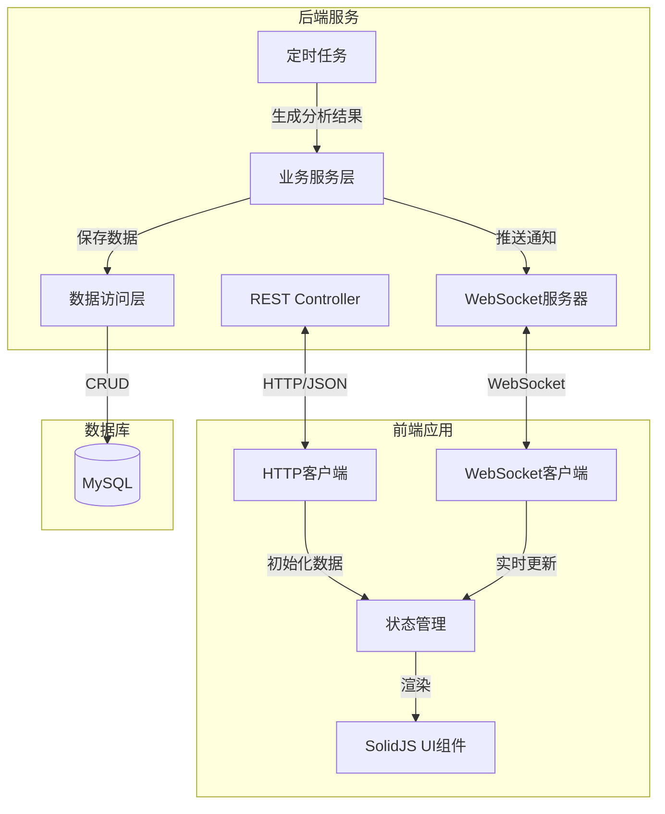
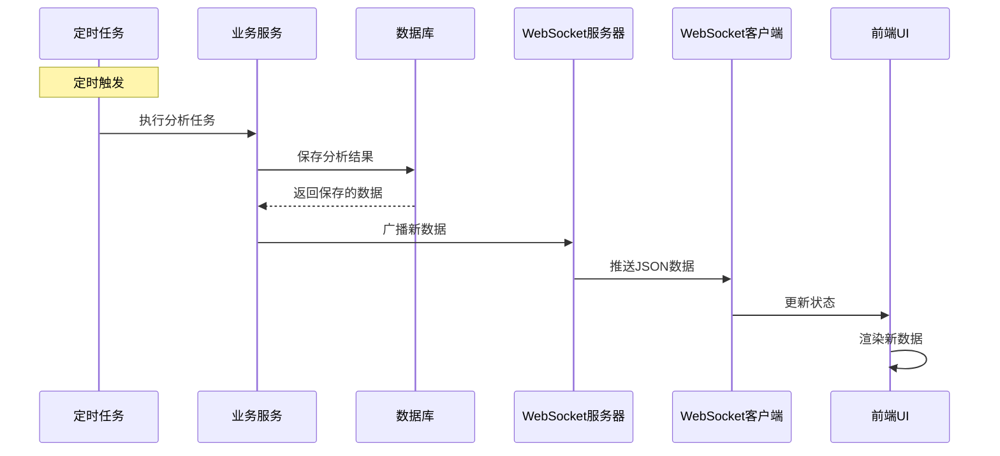

# Design Document: Real-Time Analysis Push

## Overview

本系统实现足球AI分析结果的实时推送功能，采用前后端分离架构。后端基于Spring Boot提供WebSocket推送服务和REST API，前端使用Vite + SolidJS + UnoCSS构建现代化单页应用。系统通过WebSocket实现实时双向通信，确保用户能够即时看到最新的分析结果。

### 技术栈

**后端：**
- Spring Boot 3.4.5
- Spring WebSocket
- MyBatis Plus 3.5.10
- MySQL 9.4.0
- Java 21

**前端：**
- Vite 6.x
- SolidJS 1.x
- TypeScript 5.x
- UnoCSS
- unplugin-auto-import
- WebSocket API

## Architecture

### 系统架构图



### 通信流程



## Components and Interfaces

### 后端组件

#### 1. WebSocketConfig

配置WebSocket服务器端点和消息处理器。

```java
@Configuration
@EnableWebSocket
public class WebSocketConfig implements WebSocketConfigurer {
    @Override
    public void registerWebSocketHandlers(WebSocketHandlerRegistry registry) {
        registry.addHandler(analysisWebSocketHandler(), "/ws/analysis")
                .setAllowedOrigins("*");
    }
    
    @Bean
    public AnalysisWebSocketHandler analysisWebSocketHandler() {
        return new AnalysisWebSocketHandler();
    }
}
```

#### 2. AnalysisWebSocketHandler

处理WebSocket连接和消息推送。

```java
@Component
public class AnalysisWebSocketHandler extends TextWebSocketHandler {
    private final Set<WebSocketSession> sessions = 
        Collections.synchronizedSet(new HashSet<>());
    
    @Override
    public void afterConnectionEstablished(WebSocketSession session) {
        sessions.add(session);
        log.info("WebSocket连接建立: {}", session.getId());
    }
    
    @Override
    public void afterConnectionClosed(WebSocketSession session, CloseStatus status) {
        sessions.remove(session);
        log.info("WebSocket连接关闭: {}", session.getId());
    }
    
    public void broadcast(AiAnalysisResult result) {
        String message = JSON.toJSONString(result);
        TextMessage textMessage = new TextMessage(message);
        
        sessions.forEach(session -> {
            try {
                if (session.isOpen()) {
                    session.sendMessage(textMessage);
                }
            } catch (IOException e) {
                log.error("推送消息失败: {}", session.getId(), e);
            }
        });
    }
}
```

#### 3. AnalysisResultRestController

提供REST API用于查询历史数据。

```java
@RestController
@RequestMapping("/api/analysis")
public class AnalysisResultRestController {
    
    @Autowired
    private AiAnalysisResultService analysisResultService;
    
    @GetMapping("/list")
    public ApiResponse<PageVO<AiAnalysisResult>> getAnalysisList(
            @RequestParam(defaultValue = "1") int page,
            @RequestParam(defaultValue = "20") int size) {
        
        Page<AiAnalysisResult> resultPage = analysisResultService.page(
            new Page<>(page, size),
            new QueryWrapper<AiAnalysisResult>()
                .orderByDesc("create_time")
        );
        
        return ApiResponse.success(PageVO.of(resultPage));
    }
    
    @GetMapping("/{id}")
    public ApiResponse<AiAnalysisResult> getAnalysisById(@PathVariable String id) {
        AiAnalysisResult result = analysisResultService.getById(id);
        return result != null ? 
            ApiResponse.success(result) : 
            ApiResponse.error("数据不存在");
    }
}
```

#### 4. ScheduledAnalysisTask

定时任务完成后触发推送。

```java
@Component
public class ScheduledAnalysisTask {
    
    @Autowired
    private AiAnalysisResultService analysisResultService;
    
    @Autowired
    private AnalysisWebSocketHandler webSocketHandler;
    
    @Scheduled(cron = "0 0 */2 * * ?") // 每2小时执行一次
    public void executeAnalysis() {
        // 执行分析逻辑...
        AiAnalysisResult result = performAnalysis();
        
        // 保存到数据库
        analysisResultService.save(result);
        
        // 推送到前端
        webSocketHandler.broadcast(result);
        
        log.info("分析完成并推送: matchId={}", result.getMatchId());
    }
    
    private AiAnalysisResult performAnalysis() {
        // 实际的分析逻辑
        return new AiAnalysisResult();
    }
}
```

### 前端组件

#### 1. WebSocket Service

封装WebSocket连接和重连逻辑。

```typescript
export class WebSocketService {
  private ws: WebSocket | null = null;
  private reconnectAttempts = 0;
  private maxReconnectAttempts = 5;
  private reconnectInterval = 3000;
  private listeners: Set<(data: AiAnalysisResult) => void> = new Set();
  
  constructor(private url: string) {}
  
  connect(): void {
    this.ws = new WebSocket(this.url);
    
    this.ws.onopen = () => {
      console.log('WebSocket连接成功');
      this.reconnectAttempts = 0;
    };
    
    this.ws.onmessage = (event) => {
      try {
        const data: AiAnalysisResult = JSON.parse(event.data);
        this.notifyListeners(data);
      } catch (error) {
        console.error('解析消息失败:', error);
      }
    };
    
    this.ws.onclose = () => {
      console.log('WebSocket连接关闭');
      this.attemptReconnect();
    };
    
    this.ws.onerror = (error) => {
      console.error('WebSocket错误:', error);
    };
  }
  
  private attemptReconnect(): void {
    if (this.reconnectAttempts < this.maxReconnectAttempts) {
      this.reconnectAttempts++;
      console.log(`尝试重连 (${this.reconnectAttempts}/${this.maxReconnectAttempts})`);
      setTimeout(() => this.connect(), this.reconnectInterval);
    } else {
      console.error('达到最大重连次数');
    }
  }
  
  subscribe(listener: (data: AiAnalysisResult) => void): () => void {
    this.listeners.add(listener);
    return () => this.listeners.delete(listener);
  }
  
  private notifyListeners(data: AiAnalysisResult): void {
    this.listeners.forEach(listener => listener(data));
  }
  
  disconnect(): void {
    if (this.ws) {
      this.ws.close();
      this.ws = null;
    }
  }
}
```

#### 2. API Service

封装HTTP请求。

```typescript
export class ApiService {
  constructor(private baseUrl: string) {}
  
  async getAnalysisList(page: number = 1, size: number = 20): Promise<PageResponse<AiAnalysisResult>> {
    const response = await fetch(
      `${this.baseUrl}/api/analysis/list?page=${page}&size=${size}`
    );
    
    if (!response.ok) {
      throw new Error(`HTTP错误: ${response.status}`);
    }
    
    return response.json();
  }
  
  async getAnalysisById(id: string): Promise<AiAnalysisResult> {
    const response = await fetch(`${this.baseUrl}/api/analysis/${id}`);
    
    if (!response.ok) {
      throw new Error(`HTTP错误: ${response.status}`);
    }
    
    const result = await response.json();
    return result.data;
  }
}
```

#### 3. AnalysisStore

状态管理。

```typescript
import { createSignal, createEffect } from 'solid-js';

export function createAnalysisStore() {
  const [analysisList, setAnalysisList] = createSignal<AiAnalysisResult[]>([]);
  const [loading, setLoading] = createSignal(false);
  const [error, setError] = createSignal<string | null>(null);
  const [connected, setConnected] = createSignal(false);
  
  const addAnalysis = (analysis: AiAnalysisResult) => {
    setAnalysisList(prev => [analysis, ...prev]);
  };
  
  const loadInitialData = async (apiService: ApiService) => {
    setLoading(true);
    setError(null);
    
    try {
      const response = await apiService.getAnalysisList(1, 20);
      setAnalysisList(response.data.records);
    } catch (err) {
      setError(err instanceof Error ? err.message : '加载失败');
    } finally {
      setLoading(false);
    }
  };
  
  const loadMore = async (apiService: ApiService, page: number) => {
    try {
      const response = await apiService.getAnalysisList(page, 20);
      setAnalysisList(prev => [...prev, ...response.data.records]);
    } catch (err) {
      console.error('加载更多失败:', err);
    }
  };
  
  return {
    analysisList,
    loading,
    error,
    connected,
    setConnected,
    addAnalysis,
    loadInitialData,
    loadMore
  };
}
```

#### 4. AnalysisCard Component

展示单个分析结果。

```typescript
import { Component } from 'solid-js';
import { AiAnalysisResult } from '../types';

interface AnalysisCardProps {
  analysis: AiAnalysisResult;
}

export const AnalysisCard: Component<AnalysisCardProps> = (props) => {
  const formatTime = (time: string) => {
    return new Date(time).toLocaleString('zh-CN');
  };
  
  return (
    <div class="bg-white rounded-lg shadow-md p-6 mb-4 hover:shadow-lg transition-shadow">
      <div class="flex justify-between items-center mb-4">
        <h3 class="text-xl font-bold">
          {props.analysis.homeTeam} vs {props.analysis.awayTeam}
        </h3>
        <span class="text-gray-500 text-sm">
          {formatTime(props.analysis.matchTime)}
        </span>
      </div>
      
      <div class="grid grid-cols-3 gap-4 mb-4">
        <div class="text-center">
          <div class="text-sm text-gray-600">主胜</div>
          <div class="text-lg font-semibold text-green-600">
            {props.analysis.homeWin}
          </div>
        </div>
        <div class="text-center">
          <div class="text-sm text-gray-600">平局</div>
          <div class="text-lg font-semibold text-yellow-600">
            {props.analysis.draw}
          </div>
        </div>
        <div class="text-center">
          <div class="text-sm text-gray-600">客胜</div>
          <div class="text-lg font-semibold text-blue-600">
            {props.analysis.awayWin}
          </div>
        </div>
      </div>
      
      <div class="mb-3">
        <div class="text-sm font-semibold text-gray-700 mb-1">AI预测</div>
        <div class="text-base">
          比分: {props.analysis.aiScore} | 结果: {props.analysis.aiResult}
        </div>
      </div>
      
      <div>
        <div class="text-sm font-semibold text-gray-700 mb-1">分析详情</div>
        <p class="text-gray-600 text-sm leading-relaxed">
          {props.analysis.aiAnalysis}
        </p>
      </div>
    </div>
  );
};
```

#### 5. AnalysisList Component

主列表组件。

```typescript
import { Component, For, Show, onMount, onCleanup } from 'solid-js';
import { AnalysisCard } from './AnalysisCard';
import { createAnalysisStore } from '../store/analysisStore';
import { WebSocketService } from '../services/websocket';
import { ApiService } from '../services/api';

export const AnalysisList: Component = () => {
  const store = createAnalysisStore();
  const wsService = new WebSocketService(import.meta.env.VITE_WS_URL);
  const apiService = new ApiService(import.meta.env.VITE_API_URL);
  
  onMount(async () => {
    // 加载初始数据
    await store.loadInitialData(apiService);
    
    // 建立WebSocket连接
    wsService.connect();
    
    // 订阅新数据
    const unsubscribe = wsService.subscribe((data) => {
      store.addAnalysis(data);
      store.setConnected(true);
    });
    
    onCleanup(() => {
      unsubscribe();
      wsService.disconnect();
    });
  });
  
  return (
    <div class="container mx-auto px-4 py-8 max-w-4xl">
      <div class="mb-6">
        <h1 class="text-3xl font-bold mb-2">足球AI分析</h1>
        <div class="flex items-center gap-2">
          <div class={`w-3 h-3 rounded-full ${store.connected() ? 'bg-green-500' : 'bg-red-500'}`} />
          <span class="text-sm text-gray-600">
            {store.connected() ? '实时连接' : '连接断开'}
          </span>
        </div>
      </div>
      
      <Show when={store.loading()}>
        <div class="text-center py-8">
          <div class="inline-block animate-spin rounded-full h-8 w-8 border-b-2 border-blue-600" />
        </div>
      </Show>
      
      <Show when={store.error()}>
        <div class="bg-red-100 border border-red-400 text-red-700 px-4 py-3 rounded mb-4">
          {store.error()}
        </div>
      </Show>
      
      <Show when={!store.loading() && store.analysisList().length === 0}>
        <div class="text-center py-12 text-gray-500">
          暂无分析数据
        </div>
      </Show>
      
      <For each={store.analysisList()}>
        {(analysis) => <AnalysisCard analysis={analysis} />}
      </For>
    </div>
  );
};
```

## Data Models

### AiAnalysisResult (后端实体)

```java
@Setter
@Getter
@TableName("ai_analysis_result")
public class AiAnalysisResult extends BaseEntity {
    @TableId(type = IdType.ASSIGN_ID)
    private String id;              // 主键ID
    private String matchId;         // 比赛ID
    private String homeTeam;        // 主队名称
    private String awayTeam;        // 客队名称
    private LocalDateTime matchTime; // 比赛时间
    private String homeWin;         // 主胜概率
    private String draw;            // 平局概率
    private String awayWin;         // 客胜概率
    private String aiAnalysis;      // AI分析内容
    private String aiScore;         // AI预测比分
    private String aiResult;        // AI预测结果
    private String matchResult;     // 实际比赛结果
    private String afterMatchAnalysis; // 赛后分析
    private LocalDateTime createTime;  // 创建时间
}
```

### AiAnalysisResult (前端类型)

```typescript
export interface AiAnalysisResult {
  id: string;
  matchId: string;
  homeTeam: string;
  awayTeam: string;
  matchTime: string;
  homeWin: string;
  draw: string;
  awayWin: string;
  aiAnalysis: string;
  aiScore: string;
  aiResult: string;
  matchResult?: string;
  afterMatchAnalysis?: string;
  createTime: string;
}
```

### API Response Types

```typescript
export interface ApiResponse<T> {
  code: number;
  message: string;
  data: T;
}

export interface PageResponse<T> {
  records: T[];
  total: number;
  size: number;
  current: number;
  pages: number;
}
```

## Correctness Properties

*属性是关于系统应该保持为真的特征或行为的正式陈述，适用于所有有效的执行。属性作为人类可读规范和机器可验证正确性保证之间的桥梁。*

### Property 1: WebSocket消息广播完整性

*对于任何*已连接的WebSocket会话集合，当广播一条消息时，所有处于打开状态的会话都应该接收到该消息。

**Validates: Requirements 1.4**

### Property 2: WebSocket连接状态一致性

*对于任何*WebSocket连接，当连接关闭时，该连接应该从活动会话集合中移除，并且不应再接收任何消息。

**Validates: Requirements 1.5**

### Property 3: 前端WebSocket自动重连

*对于任何*WebSocket连接断开事件，如果重连次数未达到最大限制，系统应该在指定间隔后自动尝试重新连接。

**Validates: Requirements 3.4**

### Property 4: 数据序列化往返一致性

*对于任何*有效的AiAnalysisResult对象，将其序列化为JSON后再反序列化，应该得到等价的对象（所有字段值相同）。

**Validates: Requirements 1.3, 3.3**

### Property 5: 历史数据分页查询顺序

*对于任何*历史数据查询请求，返回的结果应该按照创建时间降序排列，即最新的数据排在最前面。

**Validates: Requirements 5.4**

### Property 6: 新数据添加到列表顶部

*对于任何*通过WebSocket接收到的新分析结果，该数据应该被添加到前端列表的第一个位置。

**Validates: Requirements 4.3**

### Property 7: 错误状态不影响其他连接

*对于任何*WebSocket推送失败的情况，该错误应该被记录但不应该影响向其他正常连接推送消息。

**Validates: Requirements 1.6**

### Property 8: 配置参数有效性

*对于任何*系统配置参数（如重连间隔、最大连接数），其值应该在合理的范围内（正整数且不超过预设上限）。

**Validates: Requirements 8.2, 8.4**

## Error Handling

### 后端错误处理

1. **WebSocket连接错误**
   - 捕获IOException并记录详细日志
   - 自动清理失败的连接
   - 不中断其他正常连接的服务

2. **数据库操作错误**
   - 使用事务确保数据一致性
   - 捕获SQLException并返回友好错误信息
   - 记录完整的错误堆栈用于调试

3. **JSON序列化错误**
   - 捕获JSON解析异常
   - 记录导致错误的数据
   - 跳过无效数据继续处理

4. **资源限制**
   - 限制最大WebSocket连接数（配置化）
   - 超过限制时拒绝新连接并返回错误信息
   - 定期清理僵尸连接

### 前端错误处理

1. **WebSocket连接失败**
   - 显示连接状态指示器
   - 自动重连机制（指数退避）
   - 达到最大重试次数后提示用户手动刷新

2. **HTTP请求失败**
   - 显示错误提示信息
   - 提供重试按钮
   - 区分网络错误和服务器错误

3. **数据解析错误**
   - 捕获JSON.parse异常
   - 记录错误到控制台
   - 忽略无效数据，不影响UI渲染

4. **状态管理错误**
   - 使用try-catch包裹状态更新
   - 提供错误边界组件
   - 降级显示错误信息

## Testing Strategy

### 单元测试

**后端单元测试（JUnit 5 + Mockito）：**

1. **AnalysisWebSocketHandler测试**
   - 测试连接建立和关闭
   - 测试消息广播到多个会话
   - 测试异常连接的处理

2. **AnalysisResultRestController测试**
   - 测试分页查询API
   - 测试单个数据查询API
   - 测试错误情况（如ID不存在）

3. **Service层测试**
   - 测试数据保存逻辑
   - 测试查询逻辑
   - 测试业务规则验证

**前端单元测试（Vitest）：**

1. **WebSocketService测试**
   - 测试连接建立
   - 测试消息接收和分发
   - 测试重连逻辑

2. **ApiService测试**
   - 测试HTTP请求
   - 测试错误处理
   - 测试响应解析

3. **组件测试**
   - 测试AnalysisCard渲染
   - 测试AnalysisList数据加载
   - 测试用户交互

### 属性测试

使用**jqwik**（Java）和**fast-check**（TypeScript）进行属性测试。每个测试运行最少100次迭代。

**后端属性测试：**

1. **Property 1测试：消息广播完整性**
   ```java
   @Property
   void broadcastMessageReachesAllOpenSessions(
       @ForAll @Size(min = 1, max = 10) List<@From("openSessions") WebSocketSession> sessions,
       @ForAll AiAnalysisResult result) {
       
       // 标签: Feature: real-time-analysis-push, Property 1: 消息广播完整性
       AnalysisWebSocketHandler handler = new AnalysisWebSocketHandler();
       sessions.forEach(handler::afterConnectionEstablished);
       
       handler.broadcast(result);
       
       sessions.forEach(session -> {
           verify(session, times(1)).sendMessage(any(TextMessage.class));
       });
   }
   ```

2. **Property 4测试：序列化往返一致性**
   ```java
   @Property
   void serializationRoundTripPreservesData(@ForAll AiAnalysisResult original) {
       // 标签: Feature: real-time-analysis-push, Property 4: 序列化往返一致性
       String json = JSON.toJSONString(original);
       AiAnalysisResult deserialized = JSON.parseObject(json, AiAnalysisResult.class);
       
       assertThat(deserialized).isEqualToComparingFieldByField(original);
   }
   ```

3. **Property 5测试：分页查询顺序**
   ```java
   @Property
   void queryResultsAreSortedByCreateTimeDesc(
       @ForAll @Size(min = 2, max = 20) List<AiAnalysisResult> results) {
       
       // 标签: Feature: real-time-analysis-push, Property 5: 分页查询顺序
       results.forEach(service::save);
       
       Page<AiAnalysisResult> page = service.page(new Page<>(1, 20));
       List<AiAnalysisResult> records = page.getRecords();
       
       for (int i = 0; i < records.size() - 1; i++) {
           assertThat(records.get(i).getCreateTime())
               .isAfterOrEqualTo(records.get(i + 1).getCreateTime());
       }
   }
   ```

**前端属性测试：**

1. **Property 3测试：自动重连**
   ```typescript
   import fc from 'fast-check';
   
   // 标签: Feature: real-time-analysis-push, Property 3: 自动重连
   test('WebSocket自动重连直到达到最大次数', () => {
     fc.assert(
       fc.property(
         fc.integer({ min: 1, max: 10 }),
         (maxAttempts) => {
           const service = new WebSocketService('ws://test', maxAttempts);
           let reconnectCount = 0;
           
           // 模拟连接失败
           for (let i = 0; i < maxAttempts + 5; i++) {
             service.simulateConnectionClose();
             if (service.isReconnecting()) {
               reconnectCount++;
             }
           }
           
           return reconnectCount <= maxAttempts;
         }
       ),
       { numRuns: 100 }
     );
   });
   ```

2. **Property 6测试：新数据添加到顶部**
   ```typescript
   // 标签: Feature: real-time-analysis-push, Property 6: 新数据添加到列表顶部
   test('新数据总是添加到列表第一个位置', () => {
     fc.assert(
       fc.property(
         fc.array(fc.record({
           id: fc.string(),
           matchId: fc.string(),
           homeTeam: fc.string(),
           awayTeam: fc.string(),
           // ... 其他字段
         })),
         fc.record({
           id: fc.string(),
           matchId: fc.string(),
           homeTeam: fc.string(),
           awayTeam: fc.string(),
           // ... 其他字段
         }),
         (initialList, newItem) => {
           const store = createAnalysisStore();
           store.setAnalysisList(initialList);
           
           store.addAnalysis(newItem);
           
           const list = store.analysisList();
           return list.length > 0 && list[0].id === newItem.id;
         }
       ),
       { numRuns: 100 }
     );
   });
   ```

### 集成测试

1. **端到端WebSocket通信测试**
   - 启动后端服务器
   - 前端建立连接
   - 触发定时任务
   - 验证前端接收到数据

2. **REST API集成测试**
   - 测试完整的HTTP请求-响应流程
   - 测试数据库交互
   - 测试分页功能

3. **错误恢复测试**
   - 模拟网络中断
   - 验证重连机制
   - 验证数据一致性

### 测试配置

- 单元测试：快速反馈，覆盖具体场景
- 属性测试：每个测试最少100次迭代，验证通用属性
- 集成测试：验证组件间协作
- 所有测试使用CI/CD自动运行
